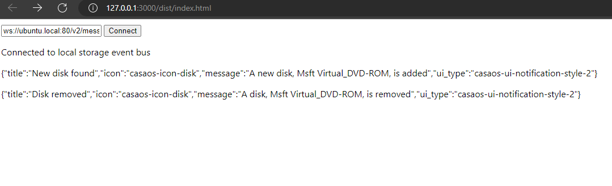

# CasaOS-LocalStorage-WASM-Demo

Just a crappy demo of consuming events from LocalStorage and transcribing each to something useful for CasaOS-UI

## Prerequisites

Following services must be running

- <https://github.com/icewhaletech/CasaOS-Gateway>
- <https://github.com/icewhaletech/CasaOS-MessageBus>
- <https://github.com/icewhaletech/CasaOS-LocalStorage>

## IDE Setup

Include following settings in `.vscode/settings.json`

```json
{
    "go.toolsEnvVars": {
        "GOOS": "js",
        "GOARCH": "wasm"
    }
}
```

## Build

```bash
bash build.sh
```

## Run

Serve `dist/index.html` to the browser.


